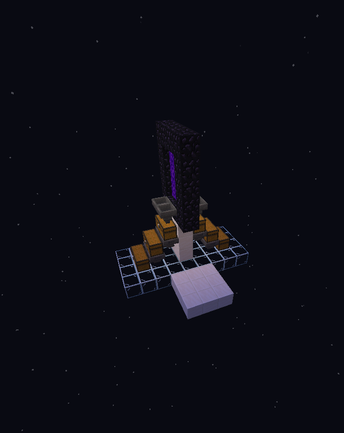

# Ghast farms

## Ghast Farms that use Nether Portals

Due to the lag that is caused when Ghasts go through a Nether Portal into the overworld, we have made some modifications to Ghast Farm mechanics.

<figure><figcaption>
This example has one small Nether Portal and hoppers on either side to pick up the Ghast drops that come through.
</figcaption></figure>

Above is the overworld part of a Ghast Farm. On Vanilla+ all you need is one small Nether Portal and hoppers on either side to pick up the Ghast drops that come through. You could easily direct the drops into a sorting system using water streams around the portal.


## Vanilla+ Specific Changes

* On Vanilla+ we do not send the whole Ghast through the portal, only its drops.
* Drop amounts are randomized according to Vanilla Looting III behavior. (Max 4 Ghast Tears, Max 5 Gunpowder)

