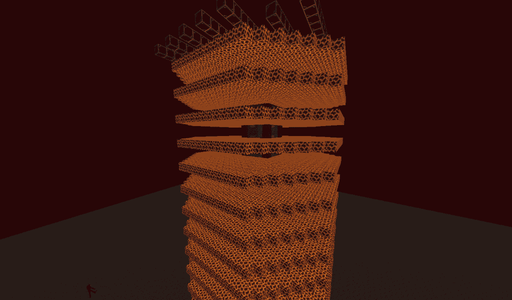
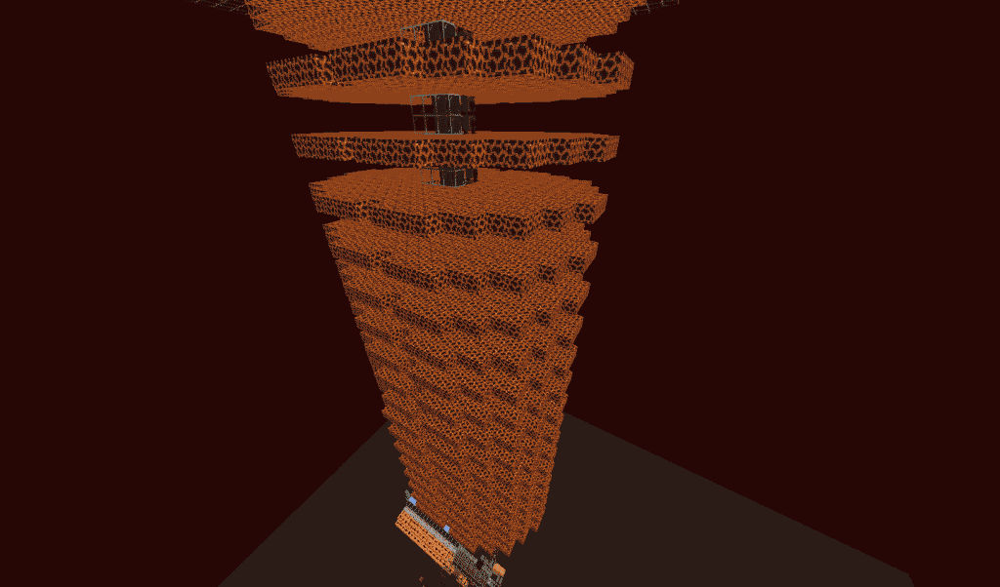

# Gold farms

## Nether Based Designs

Nether based gold farms use normal mob spawning mechanics to spawn piglins on magma block platforms and then bring them to a central area where they can be killed. These are the recommended type of gold farm on Vanilla+.

<figure><figcaption>
This nether based farm uses portals to quickly move piglins to a killing area in the overworld
</figcaption></figure>

 

<figure><figcaption>
This farm has a drop down where the piglins fall so they can easily be killed by a player
</figcaption></figure>

## Overworld Based Designs

Overworld based gold farms utilize a mechanic where pigmen spawn inside of nether portals. They involve a bunch of massive nether portals, which makes them quite expensive to build.

<figure><figcaption>
This design uses portals to spawn piglins in the overworld and funnels them to a central killing chamber
</figcaption></figure>


## Vanilla+ Specific Changes

On Vanilla+ mobs don’t spawn more than 48 blocks away from the player, this means you need to adjust your afk spot accordingly so it is the correct number of blocks from the nearest spawning platform and 48 from the furthest

