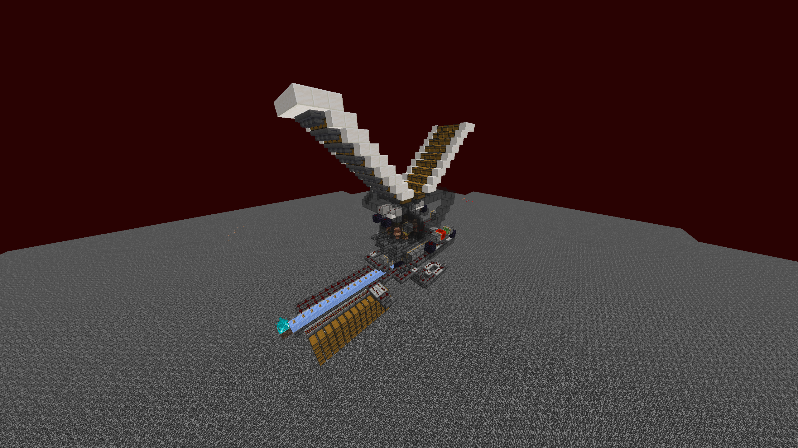

# Bartering Farms

Bartering farms are slightly modified on Vanilla+ due to two reasons.

* Entity cramming on Vanilla+ triggers at 8 entities in a block. This means you need more modules than usual to achieve "normal" rates.
* Piglins are limited to a maximum of 36 piglins per 50 block radius. This drastically limits the number of piglins you can have in a single bartering farm.

## Getting Piglins on the Nether Roof



This Piglin spawning platform is great for getting Piglins on the Nether Roof.\
Note that due to the smaller spawn radius on Vanilla+ and pack spawning limitations, you should be 30 blocks above the centre of the platform when going AFK, instead of the recommended amount in the video.

## Semi-Automatic Bartering Farm



This is a small-scale, low effort design that maxes out at 16 Piglins on Vanilla+ and requires manual feeding of Gold.\
This Design is not recommended for extended usage periods.

## Automatic Bartering Farm

[https://www.mediafire.com/file/r0pvuef1ebyztbb/DrDonttnut's+Bartering+Farm.litematic/file](https://www.mediafire.com/file/r0pvuef1ebyztbb/DrDonttnut's+Bartering+Farm.litematic/file) (Nils)

<figure><figcaption></figcaption></figure>

* Each chamber should have 3 Piglins on the chains, for a total of 36 Piglins.
* The hopper clock should have 18 items in.
