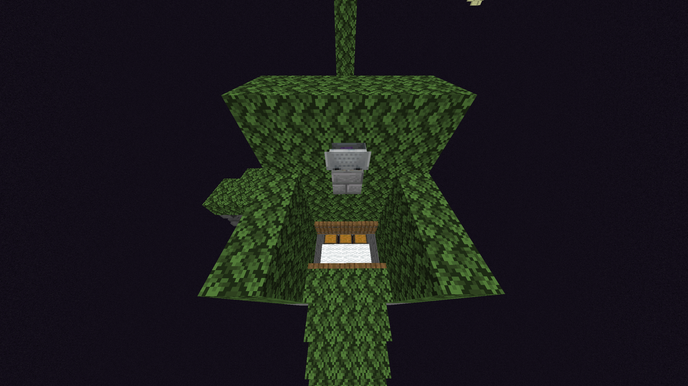

# Enderman Farms

Enderman farms are slightly modified on Vanilla+ due to Endermen rendering slightly differently than in vanilla Minecraft.


All Endermen farms should be built at y=6 to achieve the best rates possible while allowing for enough space to build storage or Shulker box loaders.


## Semi-Automatic Enderman Farms



With this design, you must put the Endermite 2 blocks higher than shown in the video, this is because after 1.20.2 Endermen ended up being able to hit the Endermite. If after doing this your Endermen are not aggroing onto the Endermite, raise the spawn platform by 1 block.

<figure><figcaption>
This is an example of the Endermite being raised 2 blocks.
</figcaption></figure>

***



This design drops Endermen from a high platform in order to make them one hit, which is very practical if  you are making an Endermen farm for XP to repair your armor in-between fights.
