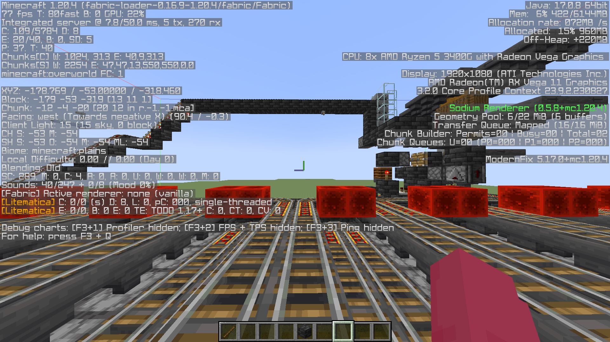
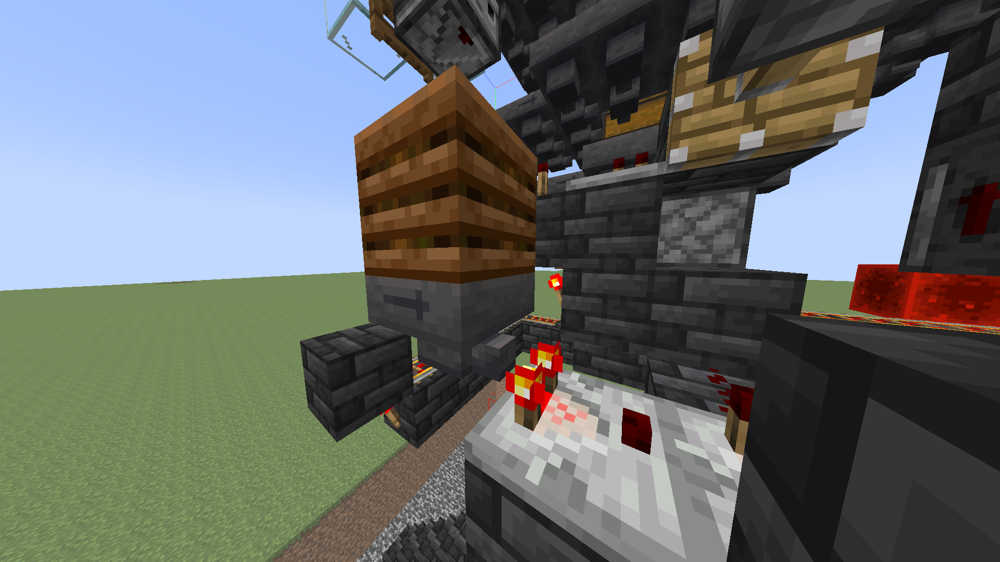

# Furnace Arrays / Auto-Smelters

Auto-smelters are slightly modified on Vanilla+ due to TPS fluctuations and reduced hopper speeds.

Due to these TPS fluctuations and reduced hopper speeds, you will notice a lot of furnaces are missed by your hopper minecart. Because of this, auto-smelters are typically around 50% as efficient on Vanilla+ as they would be a regular survival world.

## Fueling

The majority of people will use coal, blaze rods or other conventional methods to smelt their items. However, if you're smelting a bulk amount of items and do not have the fuel required for an extended smelting session, you may wish to hook a lava farm up to your smelter.



## Super-smelters


Super-smelters refer to large-scale auto-smelters.


[ https://www.mediafire.com/file/vnurjstb6gpbvjz/Autosmelter+by+Dropjawed.litematic/file](https://www.mediafire.com/file/vnurjstb6gpbvjz/Autosmelter+by+Dropjawed.litematic/file) (Dropjawed)

The above super-smelter is directional and must be built facing East or West according to following screenshot.

<figure><figcaption>
When looking at the farm from this direction, you must either be looking East or West.
</figcaption></figure>

<figure><figcaption>
The immediate hopper in this screenshot must have 1 stack and 56 items in it.
</figcaption></figure>

* Before using the farm, you must load 6 hopper minecarts into the glass tube with the fence gate at the bottom. You can do this simply by pushing them in from above.
* This farm is recommended to use Coal Blocks. You can load your fuel into the chest minecart that travels around the lower rail system.
* You can place sand Shulkers directly onto the hoppers that feed into the loading bay, removing the need to manually move items into chests.


If you're having issues with this design you can seek support in the Vanilla+ Community Hub Discord.

[https://discord.gg/G84mQa7H2y](https://discord.gg/G84mQa7H2y)


***

## Auto-smelters

Autosmelters do not suffer from the reduced hopper speed issue at the cost of being smaller and overall slower.


