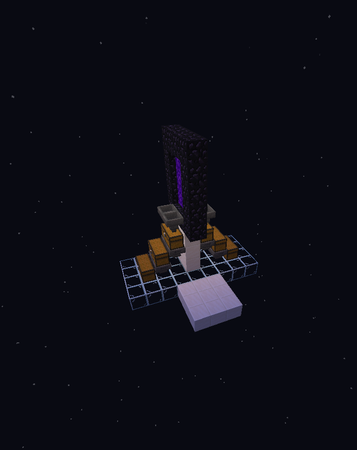

# Ghast Farms

## Ghast Changes

Due to the lag that is caused when Ghasts go through a Nether portal into the overworld, we have made some modifications to Ghast farm mechanics.

When a Ghast enters a Nether portal, it is automatically killed and converted into Ghast tears and gunpowder with the looting 3 affect applied. Due to this change, all you need on Vanilla+ is one small Nether portal and hoppers on either side to pick up the Ghast drops that come through the portal.

Additionally, you do not need an account in the overworld side to load the collection system, this is done automatically.

<figure><figcaption>
This example has one small Nether Portal and hoppers on either side to pick up the Ghast drops that come through.
</figcaption></figure>


* On Vanilla+ we do not send the whole Ghast through the portal, only its drops.
* Drop amounts are randomized according to Vanilla Looting III behavior. (Max 4 Ghast Tears, Max 5 Gunpowder)


***

## Simple Automatic Ghast Farm


(ianxofour)


Please note that due to Ghasts automatically dying, you do not need to resend the Ghasts back to the nether, they die when entering the overworld, meaning you need to make your collection system there, not in the nether as shown in the above tutorial.


Due to the reduced spawn radius on Vanilla+, you are limited to how big you can make this farm. Make sure to remember you must be 24 blocks above the farm when you go to AFK it.

This farm should be built in a Soul Sand Valley biome.


## Donut-Shaped Ghast Farm

[https://www.mediafire.com/file/a4t8v1rpasqe1m6/donut\_ghast\_farm.litematic/file](https://www.mediafire.com/file/a4t8v1rpasqe1m6/donut_ghast_farm.litematic/file) (Obs\_)

You do not need to use glowstone anymore in the above schematic, just build the spawn platforms out of solid blocks, there is no longer any need for light sources.

\
It is **imperative** that you orientate your Donut-Shaped Ghast Farm in the correct direction, this direction changes according to each individual situation.&#x20;

\
You can use the following orientation tutorial to figure out how to orientate your farm correctly.


If the farm is not oreinated correctly, it will not work.


***

## Sphere Automatic Ghast Farm

[https://www.mediafire.com/file/iott3aa80m518ts/DrDonttnut's+Sphere+Ghast+Farm.litematic/file](https://www.mediafire.com/file/iott3aa80m518ts/DrDonttnut's+Sphere+Ghast+Farm.litematic/file) (Obs\_ + Nils)

**There are two versions of this farm.**

Both versions of the farm should be build in a Soul Sand Valley

### Building an Overworld Corner Sphere Ghast Farm

To build the world corner version, your Sphere Ghast Farm must be over 50,000 x 50,000 blocks out in the Nether.

When it coms to building your collection system, your portals should send you to the world corner corresponding to the quadrant you built in. Simply build a collection system there.


The main downside to this version of the farm is that the world corners are frequently visited, meaning your collection system will be found very often.


### Building a Multiple Collection Point Sphere Ghast Farm

To build the version that uses multiple collection points, you should use the same co-ordinate method that you would use to make a normal Donut-Shaped Ghast Farm; one co-ordinate should be over 50,000 and the other should be below 50,000.

When linking the portals, take the co-ordinates from the furthest left point of the sphere and the furthest right point of the sphere, then multiply those co-ordinates respectively and make overworld collection systems at both those co-ordinates in the Overworld.\
If you still need one more portal due to Ghasts not being processed and clogging the farm, take the co-ordinates from the centre of the farm, multiply them by 8 and make a third collection point at those co-ordinates in the Overworld.


Pros: This version will not be found as quick as the world corner version\
Cons: Having multiple collection points makes collecting your drops more tedious.

