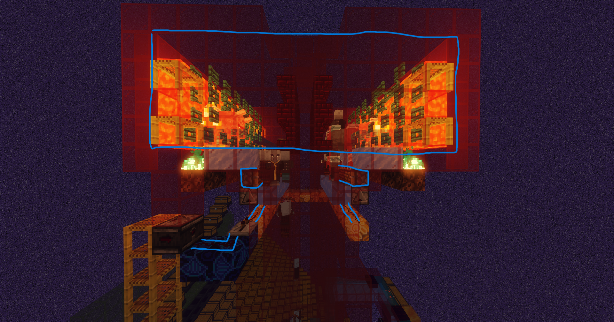

# Raid farms

### Designing your raid farm to work on Vanilla+

Raid farms are easily one of the most difficult farms to make in Minecraft. Additionally, because of the number of mobs that some raid farms are able to spawn, Vanilla+ has optimizations put in place to:\
\
A: Improve the performance of the individual mobs.\
B: Nerf the speed at which mobs can spawn.\
C: Remove some useless mobs entirely.

Even with these optimzations in place, raid farms are still very heavy on the server. Due to this, this article will not be too detailed to restrict access of raid farms to the few, rather than the many. Staff will not provide support for fixing or making raid farms for this reason.

Many players offer raid farm designs for in-game items, you are welcome to make these trades, however please be aware that because the trade is not taking place over `/trade` you may be scammed, which in this case is not against [the rules.](../server-info/rules.md)


* Vexes are disabled and do not spawn on Vanilla+.
* There is a cooldown between raids starting of 30 seconds.
* Stacking raid farms may or may not work and are **not recommended**, in some cases having a player near the villager will make them work.


### Spawning chambers

This is an example of a killing chamber from a raid farm that works on Vanilla+

#### Things to note from this screenshot:

* Uses pistons to push raid mobs further down into the farm
  * The pistons are timed to extend at around every 140 ticks (7 seconds)

<figure><figcaption></figcaption></figure>

