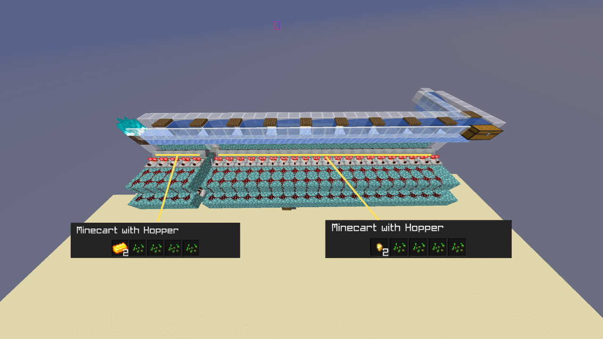
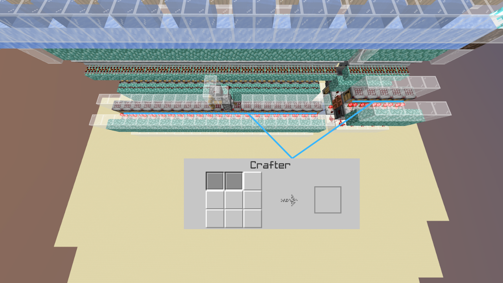

# Gold Farm Auto-Crafter

Schematic: [https://www.mediafire.com/file/p7cd2o2ai9bpvbp/1wt\_Gold\_Farm\_Autocrafter\_by\_Dropjawed.litematic/file](https://www.mediafire.com/file/p7cd2o2ai9bpvbp/1wt_Gold_Farm_Autocrafter_by_Dropjawed.litematic/file) (Dropjawed)

This design automatically converts all golden nuggets and gold ingots into gold blocks before storing them automatically into Shulker boxes.\

***

<figure><figcaption>
Ensure the highlighted Hopper Minecarts are configured as shown in the screenshot.
</figcaption></figure>

***

<figure><figcaption>
Ensure the highlited Crafters are configured as shown in the screenshot.
</figcaption></figure>

***

Credits:\
\
1wt Precise Compactor: [https://www.youtube.com/watch?v=RR-wcDzL1nY](https://www.youtube.com/watch?v=RR-wcDzL1nY) (Brandon Henness)
