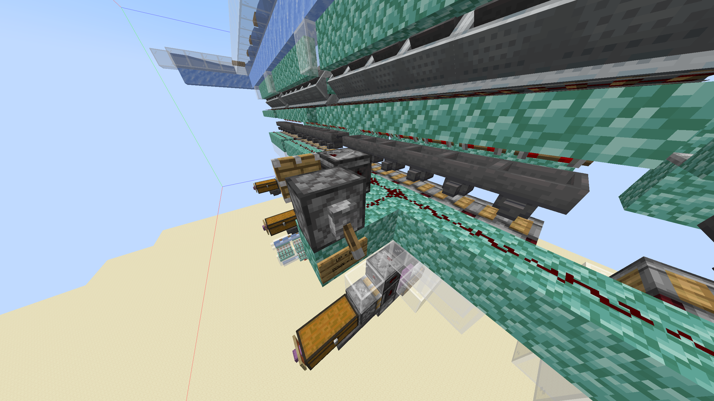
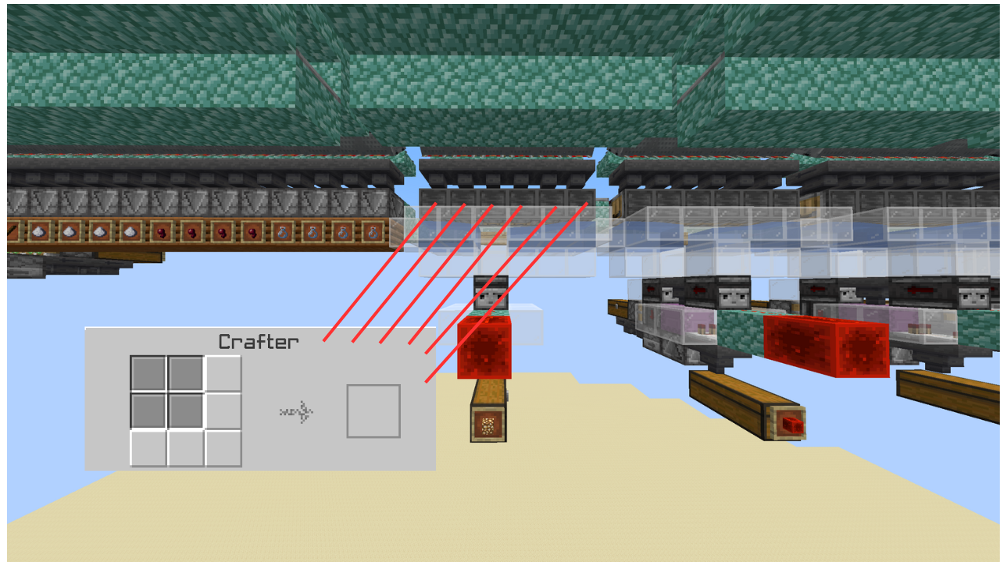

# Raid Farm Auto-Crafter

Schematic:\
[https://www.mediafire.com/file/q68c4qkm2n2sgvu/Raid\_Farm\_Autocrafter\_v2\_by\_Dropjawed.litematic/file](https://www.mediafire.com/file/q68c4qkm2n2sgvu/Raid_Farm_Autocrafter_v2_by_Dropjawed.litematic/file) (Dropjawed)

There is a lever to turn the Auto-Crafter on and off on the back of the piston clock. \
All item filters have their corresponding item set as an item frame below so you know what to configure each filter to.

<figure><figcaption>
Here is the lever mentioned above.
</figcaption></figure>

***

<figure><figcaption>
Ensure the Crafters for the Glowstone sorters are configured as shown.
</figcaption></figure>

***

* Bottles, sticks, sugar and spider eyes are all despawned with this design, if you wish to save them, copy the gunpowder Shulker loaders where the composters for the item you wish to save are.\
