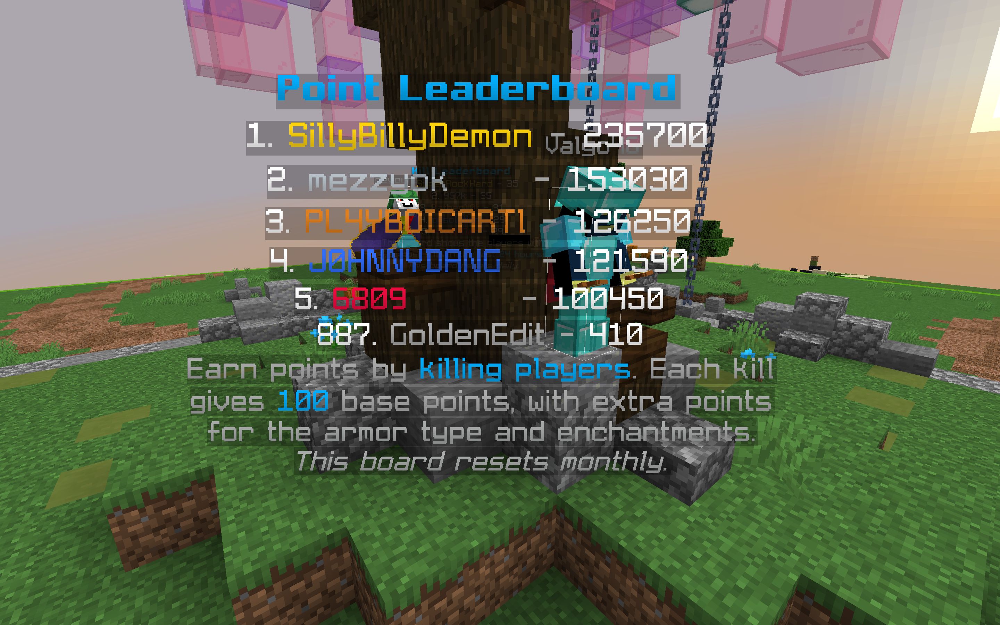

# Leaderboard System

<figure><figcaption></figcaption></figure>
Earn points by killing players. Every kill yields 100 base points, with extra points for the armor the player was wearing and the enchantments on the armor. Read below for more information on this feature.

## Leaderboard rewards

* When the leaderboard resets on the 1st of every month at 4 PM EST, the top 3 players will receive 5 days of [Legend Rank](broken-reference).

## How points are calculated

1. **Base Points:** Every kill begins with 100 base points
2. **Armor Bonus:** Points increase depending on the type and enchantment level of the victim's armor:
   * **Diamond Armor:** +30 points.
   * **Netherite Armor:** +50 points.
   * **Enchantments:** Additional points for enchantments like Protection  and Blast Protection, calculated as:
     * Level of Enchantment × 30 for Protection enchantments.
     * Level of Enchantment × 10 for other enchantments.

## Kill count restrictions

To maintain fairness and prevent point farming, restrictions are placed on how often you can earn points by killing the same player:

**3-Kills Rule:**

* You can only earn points from killing the same player up to three times within a 6-hour window.
* If you exceed this limit, you will receive a notification in red text, explaining that no points will be awarded for further kills on that player during the specified timeframe.

## Leaderboard update interval

* The in-game leaderboard at spawn updates every 60 seconds.
  * When the in-game leaderboard updates, if there is a new player in 1st place it will be announced in chat.
* The leaderboard on https://vanillaplus.net/ updates every 300 seconds.

## Leaderboard reset

* The leaderboard resets on the 1st of every month at 4pm EST.
