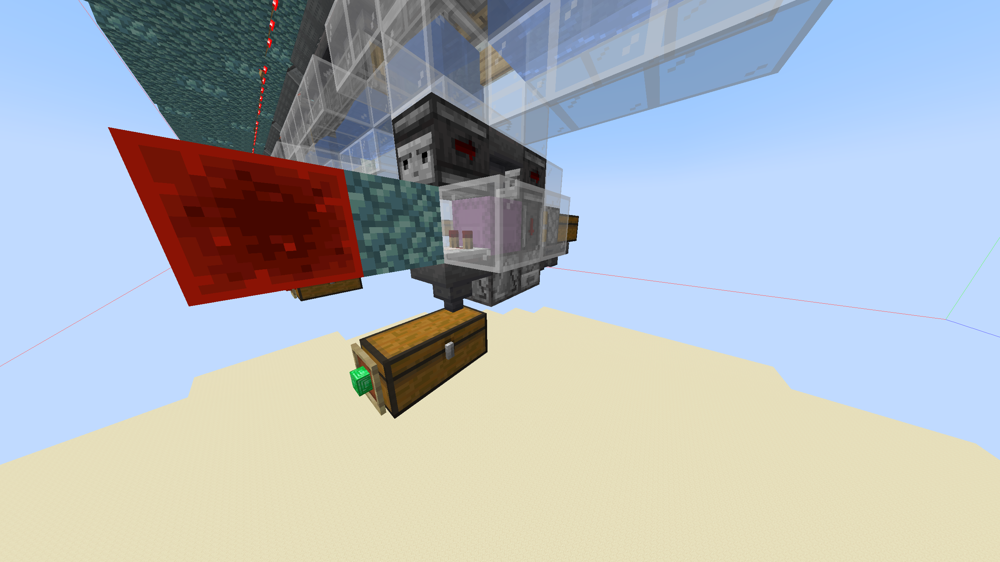

# Shulker Box Loaders and Unloaders

## Shulker Box Loaders


credits to SamosTheSage


***

The first half of this video covers Shulker box loaders.\
\
Nothing changes with the Redstone in Shulker box loaders on Vanilla+, the only thing you may have to change is adding a wall on the sides of your Shulker box and Redstone comparator, to keep the Shulker boxes from flying out of the farm.

You may occasionally notice a filled Shulker box has landed in the hopper next to it if you tile these next to each-other, this is nothing to worry about, just a product of TPS fluctuation.

<figure><figcaption>
This is an example of the walls you may have to build.
</figcaption></figure>

***

## Shulker Box Unloaders

The second half of the above video covers Shulker box unloaders.

Nothing changes with the Redstone in Shulker box unloaders, the only thing you may have to change is adding a wall on the sides of your Shulker box and Redstone comparator, the exact same as you would a Shulker box loader.
