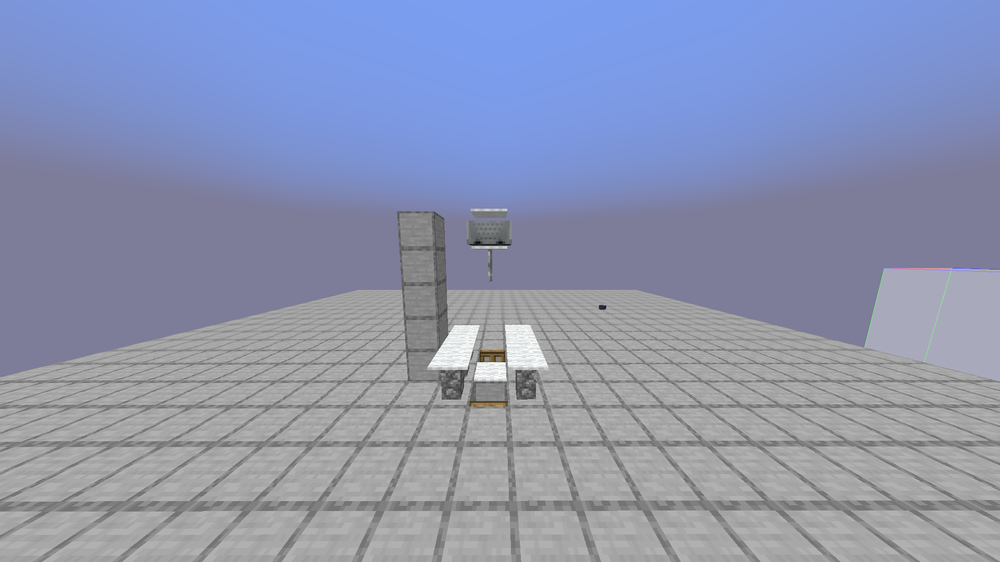

# Wither Rose Farms

Wither Rose Farms are not modified on Vanilla+, however designs that use End Gateways do not work on Vanilla+ as you cannot break the gateway itself.

***

## Automatic Wither Rose Farm


Design and tutorial by Redstonia


The original schematic to the above farm was deleted, however you can still find it here:\
[https://www.mediafire.com/file/pzyoaf0hklhkjp9/end\_wither\_rose\_farm.litematic/file](https://www.mediafire.com/file/pzyoaf0hklhkjp9/end_wither_rose_farm.litematic/file)

<figure><figcaption>
The blocks on the side should help see how high up the Minecart has to be.
</figcaption></figure>

The Endermite location has to be built higher than in the schematic due to 1.20.4 changing Endermen's reach distance.
