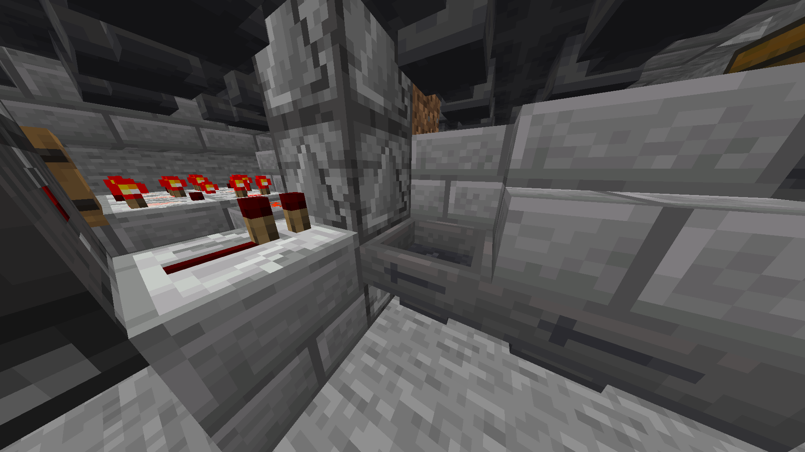

# Wood Farms

Tree farms are slightly modified on Vanilla+ due to TNT duping being disabled, therefore requiring a constant supply of TNT being dispensed into the farm.

***

## Axe/Hand Tree Farm


Design and tutorial by NimsTV


The Nims Tree Farm requires a few changes to work consistently on Vanilla+.

<figure><figcaption></figcaption></figure>

The immediate hopper in this screenshot must have the Redstone dust that was originally on it removed as it caused the hopper to constantly lock itself.

***

<figure><figcaption></figcaption></figure>

You must add an observer clock as shown in the above screenshot to activate the droppers and dispensers that the previous Redstone dust would've. \
You can optionally add a sticky piston with a lever on as an on and off switch if the noise annoys you.

***

## TNT Based Tree Farm


Please read below.


This design needs altering slightly to swap the TNT duper out for a TNT dispenser. \
The attached schematic does so for you.


